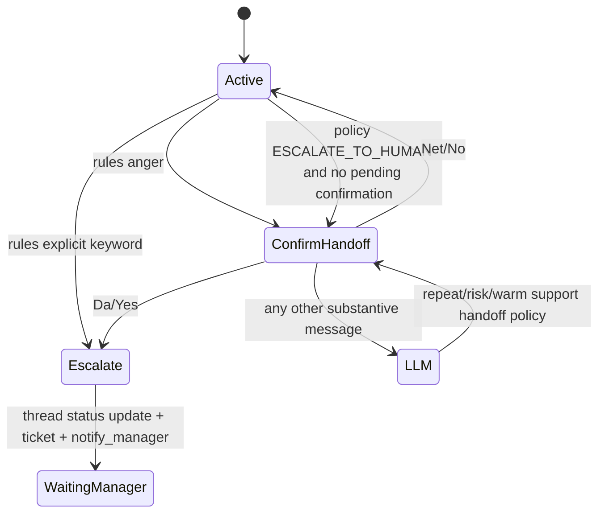

# Answer Behavior Business Audit

Date: 2026-07-22
Branch: `rescue/0d59-projection-cutover`
Scope: read-only audit of answer formation and multi-turn business behavior. Production behavior was not changed by this audit; only this document and a characterization test were added.

Update: a follow-up remediation patch fixed BUG-001 and BUG-002 by adding an explicit current-turn `resolved_cta` / `resolved_cta_reply` signal and a policy merge contract. Confirmed `book_consultation + affirmative` currently uses the same manager handoff/ticket route as `call_manager`; a separate booking flow is not implemented and remains a product decision. Repeat semantics, broad handoff keywords, manager payload, summarization, and prompt context limitations remain backlog items.

## 1. Executive Summary

The runtime answer flow is a fixed LangGraph pipeline:

```text
load_state -> rules_check -> intent_extractor -> policy_engine
  -> kb_search -> response_generator -> responder -> persist
  -> template_response -> responder -> persist
  -> escalate -> responder -> persist
```

The current patch improves CTA normalization, one-turn pending CTA lifecycle, bounded RAG traces, turn-scoped `knowledge_query`, and `continue_explanation`. The follow-up remediation patch closes the confirmed full-path gap for `continue_explanation` and `call_manager` CTA acceptance. The remaining audit backlog still has several business-level mismatches:

1. Repeat detection means "same intent or same topic as previous turn", not "failed repeated question"; it escalates normal deepening in pricing/product/integration after 3 consecutive topic turns.
2. `rules.py` explicit handoff keywords are broad substring matches (`human`, `manager`, `человека`) and can escalate product questions such as "human-in-the-loop".
3. The response generator does not receive explicit `intent`, `topic`, `cta`, `turn_relation`, `emotion`, or `requires_human` fields in the prompt. It sees only current input, last 5 rendered history items, user memory, project context, and KB evidence.

`RAG_DEBUG=true` in Render environment is enough after service restart. It is read through `os.getenv`, not Pydantic Settings, and root logging is INFO JSON to stdout.

## 2. Actual Answer Flow Architecture

Graph wiring evidence: `src/agent/graph.py:124-229`.

| node | input fields | output fields | branching conditions | side effects | degradation behavior | business purpose |
|---|---|---|---|---|---|---|
| `load_state` | `thread_id`, injected repos | `project_id`, `client_id`, `thread_status`, `conversation_summary`, `history`, analytics fields, persisted `state_json`, `user_memory`, `dialog_state` | always next `rules_check` | reads thread, messages, state_json, project config, user memory | empty memory on memory load failure | hydrate the turn with prior state |
| `rules_check` | `user_input`, `dialog_state` | `decision`, optional `response_text`, `dialog_state`, `requires_human` | explicit handoff -> `ESCALATE`; handoff confirmation -> `ESCALATE`/`RESPOND`/LLM; anger -> `RESPOND`; else LLM | none | empty input proceeds to LLM | cheap deterministic routing |
| `intent_extractor` | `user_input`, summary, last history, user memory, topic/cta/dialog_state | intent payload fields, `knowledge_query` | always next `policy_engine` | LLM call | technical user-visible response patch | semantic classification and short reply normalization |
| `policy_engine` | intent, lifecycle, features, dialog_state, domain flags | `decision`, `cta`, `topic`, `lead_status`, `dialog_state`, maybe `response_text` | template domains; lifecycle/repeat/handoff decisions | optional `policy_decision` event | preserves technical response patches | business policy routing |
| `kb_search` | `project_id`, `thread_id`, `user_input`, conditional `knowledge_query` | `knowledge_chunks` | only reached on `LLM_GENERATE` | `search_knowledge` tool | empty chunks on missing context/error | retrieve project evidence |
| `response_generator` | decision, user_input, history, chunks, memory, project config | `response_text`, metadata, optional response `cta/topic` | only generative decisions | response LLM call | technical failure fallback | compose user-visible answer |
| `template_response` | domain, turn_relation, optional response_text | deterministic `response_text` | template route | none | generic response | deterministic non-RAG replies |
| `tool_executor` | `tool_name`, `tool_args` | tool_result/requires_human/response_text | tool success vs failure | runtime tool call | handoff fallback on failure | execute selected action tools |
| `escalate` | thread/project/client/user_input | `requires_human`, `response_text`, `tool_result` | missing thread fallback | thread status update, ticket create, manager notify, metrics queue | degrade and continue on each side effect failure | handoff to human |
| `responder` | chat_id, response_text/tool_result | `message_sent`, `response_text=None` on success | missing chat/send failure | Telegram send; assistant message save | requires human fallback on send failure | deliver response |
| `persist` | final graph state | none | always terminal | save assistant if response_text present, save state_json, events, memory, analytics, technical incident | logs and continues on failures | persist state/memory/events |

Important full paths:

| scenario | actual path |
|---|---|
| normal question | `rules -> intent_extractor -> policy_engine -> kb_search -> response_generator -> responder -> persist` |
| short reply without pending CTA | same as normal, often searches literal short text unless intent marks template/ambiguous |
| short reply with `continue_explanation` | intent creates `knowledge_query`, but policy may overwrite `cta`; full path can still search `"Да"` |
| repeat question | same as normal until repeat threshold; at threshold policy returns handoff confirmation `RESPOND` |
| explicit manager request | `rules -> escalate -> responder -> persist`; no intent/KB/LLM |
| anger | `rules -> responder -> persist`, asking for handoff confirmation |
| empty KB result | `kb_search` returns `knowledge_chunks=[]`, generator still runs |
| retrieval exception | `kb_search` logs exception and returns empty chunks, generator still runs |
| generation failure | `response_generator` returns technical fallback; responder/persist continue |
| technical replay | repeated technical failure can create a technical incident in persist |

## 3. What The Bot Actually Remembers

### Message History

Source:

- `ClientMessageService._record_user_message()` stores the current user message before graph execution.
- `ThreadMessageRepository.get_messages_for_langgraph()` loads all messages for the thread in ascending `created_at` order.
- `GraphExecutor.trim_recent_history()` trims to last 10 before building graph input.
- `prompt_builder.format_history()` trims again to last 5 rendered messages and truncates each content to 220 chars.

The current user message is already in DB when history is loaded for a single-question message, so history can include the current user input plus `Client message: {user_input}` separately. For multi-question splitting, the full original message is stored once before processing each split question; each graph invocation gets the split question as `user_input`.

The assistant response is saved by `responder` on successful delivery. `responder` returns `response_text=None`, so `persist` usually does not save it again. If delivery does not happen through responder, `persist` can save `response_text`.

Risks:

- no DB LIMIT in `get_messages_for_langgraph()`, only application-side trimming;
- current user text may appear both in history and as current input;
- prompt sees only 5 messages, so longer context depends on summary/memory;
- summary is not currently generated.

### Structured Dialog State

Fields:

| field | created/loaded | changed | persisted | read by |
|---|---|---|---|---|
| `last_intent` | default/memory/state_json | repeat update/persistence | state_json + memory `dialog_state` | intent, policy, prompt memory |
| `last_topic` | default/memory/state_json | repeat update/persistence | state_json + memory `dialog_state` | intent, policy, prompt memory |
| `last_cta` | default/memory/state_json | CTA lifecycle in persistence; repeat update can remember pending CTA | state_json + memory `dialog_state` | intent, rules indirectly, prompt memory |
| `repeat_count` | default/memory/state_json | policy repeat calculation; persistence ensure | state_json + memory `dialog_state` | policy, response continuation guard, prompt memory |
| `lead_status` | default/memory/state_json | policy/persistence | state_json + memory `dialog_state` | prompt memory |
| `lifecycle` | analytics/state/memory | policy/persistence | analytics + state_json + memory stage/dialog_state | policy, prompt memory |
| `handoff_confirmation_pending` | default/memory/state_json | rules/policy handoff confirmation | state_json + memory `dialog_state` | rules, policy |

Conflict behavior:

- `load_state` starts from analytics, history, state_json, then memory if no direct `dialog_state`.
- persisted `state_json` can overwrite earlier analytics fields.
- `PolicyDecisionContext` prefers runtime `dialog_state`; otherwise falls back to `user_memory`.
- `PersistenceContext` merges memory dialog state with runtime dialog state, with runtime state winning after `merged.update(dialog_state)`.

Stale value risk:

- pending CTA lifecycle is now one-turn in persistence.
- `handoff_confirmation_pending` is cleared on confirm, decline, or new details; technical replay does not have a special keep rule in `rules`.
- `knowledge_query` is now excluded from persistence, but full-flow policy can erase the `cta` required by `kb_search` to use it.

### User Memory

Real memory writes from `PersistenceContext.memory_write_candidates()`:

- `dialog_state` type `dialog_state`;
- `stage` type `lifecycle`;
- `contact_preference` type `preferences`;
- `price_sensitivity` type `behavior`;
- `pricing_objection` type `rejections`;
- `active_issue` type `issues`.

Prompt usage:

- response prompt renders `preferences`, `rejections`, `behavior`, `issues`, `context`, `agreements`, `profile`, `dialog_state`.
- policy uses only `dialog_state` via memory fallback.
- no code observed using `contact_preference` or issue memory for deterministic routing; they are advisory to the LLM.

### Conversation Summary

`threads.context_summary` is loaded and passed into both intent and response prompts. `ThreadRuntimeStateRepository.update_summary()` exists, and `ConversationOrchestrator.SUMMARY_THRESHOLD = 20` exists, but `persist` explicitly says `summarizer remains intentionally deferred`; no runtime summary generation is active in the inspected answer path.

Honest answer: the bot reliably remembers recent messages, structured dialog state, and a small set of memory facts. It does not currently maintain an active rolling semantic summary, so beyond the last 5 prompt-rendered messages it relies on coarse memory fields and whatever state_json/user_memory preserved.

## 4. Repeat Semantics

Evidence: `src/domain/runtime/policy/repeat_detection.py:26-39`.

Current meaning:

```python
if intent == prev_intent or topic == prev_topic:
    repeat_count = previous_count + 1
else:
    repeat_count = 1
```

So `repeat_count` means "consecutive turn has same intent or same topic", not "the user repeated an unresolved question".

Scenario analysis:

| scenario | actual behavior |
|---|---|
| exact repeat `Сколько стоит?` -> `Сколько стоит?` | count increments; may be appropriate |
| same topic, new pricing question | count increments incorrectly as "repeat" |
| same intent, different topics | can increment if intent stays same |
| integration deepening | each follow-up can increment; third turn can trigger handoff confirmation |
| paraphrased repeat | only detected if LLM maps same intent/topic; no semantic similarity |
| return to topic later | if immediate previous topic differs, count resets to 1; old context not tracked |

Escalation correctness:

- soft threshold 2 changes lifecycle/CTA pressure;
- threshold 3 for high intent topics triggers human handoff decision;
- this is not a reliable measure of failed answers.

## 5. Handoff Semantics

State transition overview:



Findings:

- Explicit handoff in `rules.py` has priority over intent/RAG/LLM.
- Escalation payload includes only `User message: {current user_input}`. It does not include history, summary, topic, collected details, or last unresolved question.
- Queue notification also includes only thread/project/current message.
- False positives are possible because keyword matching is substring-based and broad. `human-in-the-loop` escalates.
- Repeat escalation first asks for handoff confirmation from policy, it does not immediately create a ticket unless confirmation is already pending or lifecycle is already handoff.
- Decline text is currently: "Хорошо, не передаю. Добавьте, пожалуйста, детали, и я уточню запрос." This asks for more details even though the user just declined handoff.
- `handoff_confirmation_pending` is independent from `last_cta`; both can coexist unless cleared by rules/persistence paths.

## 6. Continuation Semantics

`continue_explanation` was added as conversational CTA. Intended model:

- generator sets `cta=continue_explanation` with a prompt like "Хотите узнать больше...";
- next affirmative reply creates a localized `knowledge_query`;
- next negative reply turns off KB search;
- other content expires the CTA.

Actual full-flow issue:

- `intent_extractor` sets `cta=continue_explanation` and `knowledge_query`.
- `policy_engine` recomputes `cta` from lifecycle/intent/topic and can output `cta=none`, `book_consultation`, or `call_manager`.
- `KnowledgeSearchContext` requires `cta=continue_explanation` to use `knowledge_query`.
- Characterization confirms `yes_after_continuation` searches literal `"Да"` in the full path.

Continuation offer guard:

```text
topic product/integration
decision LLM_GENERATE/RESPOND_KB
no current action/conversational CTA
not short_reply/continuation
repeat_count <= 1
response does not end with ?
not fallback
```

This is conservative, but because policy often sets action CTA for cold/interested/warm product/integration turns, `continue_explanation` may appear mainly when lifecycle is `active_client` or when policy CTA is `none`.

## 7. Retrieval And Generation Context

| field | graph state | ResponseGenerationContext | prompt payload | rendered prompt | prompt instruction actually uses it |
|---|---|---|---|---|---|
| current user input | yes | yes | yes | yes | yes |
| resolved `knowledge_query` | yes, ephemeral | no | no | no | no |
| retrieved entries | yes | yes | yes | yes, id omitted but score/content shown | yes |
| message history | yes | yes | yes | last 5 | yes |
| conversation summary | yes | yes | yes | yes | yes, if non-empty |
| user memory | yes | yes | yes | yes, formatted | yes |
| dialog state | yes | merged into user_memory for prompt | indirectly | lifecycle/lead/topic/intent/repeat only | yes, via interpretation block |
| last CTA | yes | not explicitly | only if in memory? no formatter omits last_cta | mostly no | no |
| repeat count | yes | dialog_state object available | indirectly | yes in dialog_state memory | weakly |
| lead status/lifecycle | yes | dialog_state/user_memory | indirectly | yes | yes |
| intent/topic/emotion/turn_relation | yes | intent/topic/turn_relation available in context | no | no | no |
| tool results | yes | no | no | no | delivery can use tool text |

Risks:

- generator can ask for already-known details if those details are older than last 5 messages and not written to memory;
- generator can repeat previous answer because no explicit answer-plan or used-evidence trace is fed back;
- continuation can be offered without seeing `intent/turn_relation` in the prompt; post-processing uses context, not prompt;
- manager CTA and continuation CTA can conflict at policy/generator boundaries;
- old `knowledge_chunks` are replaced by `kb_search` on search turns, but if a generative path ever skips KB with old chunks in state, there is a stale-evidence risk.

## 8. RAG Logging Runtime Wiring

Answers:

1. Yes. Adding `RAG_DEBUG=true` in Render Environment and restarting the service is sufficient.
2. Yes. Both nodes read `os.getenv("RAG_DEBUG")` directly; Pydantic Settings is not involved.
3. `RAG semantic retrieval trace` appears only on turns that execute `kb_search` and reach the success path after tool execution. `RAG generation context trace` appears on generative turns before the response LLM call when decision is `LLM_GENERATE`, `RESPOND_KB`, or `RESPOND_TEMPLATE`.
4. Render logs: service stdout/stderr. Docker/supervisor routes uvicorn stdout/stderr to `/dev/stdout`/`/dev/stderr`; Render captures those.
5. Not filtered: `configure_logging()` sets root logger to INFO.
6. `extra` fields are preserved by structlog JSON rendering. Sensitive keys are redacted by key-name/pattern rules.
7. Trace behavior:

| case | retrieval trace | generation trace |
|---|---|---|
| successful retrieval with results | yes, if `RAG_DEBUG=true` | yes |
| successful empty retrieval | yes, because result path still runs | yes |
| retrieval exception | no semantic retrieval trace; only bounded exception log | yes, with empty chunks |
| answer without KB search/template/rules response | no | no if response bypasses response_generator |
| fallback generation from LLM exception | no extra trace beyond pre-call generation context; technical fallback logs exception |
| language mismatch fallback | generation context trace yes; response text fallback no extra full prompt |

No startup log was added because direct process env and logging configuration are verifiable from code.

## 9. Business Scenario Table

Characterization file: `tests/audit/test_answer_behavior_characterization.py`.

| # | scenario | expected business outcome | characterized actual |
|---:|---|---|---|
| 1 | first product question | Explain product value | full RAG path; policy often sets action CTA, not continuation |
| 2 | yes after continuation | Continue product explanation | full path searches `"Да"` because policy erases continuation CTA |
| 3 | no after continuation | consume CTA and close | intent can disable KB, policy/template path may still ask generic detail depending state |
| 4 | new pricing question instead of continuation | expire old CTA and answer pricing | treated as pricing, old CTA cleared by persistence |
| 5 | exact repeat | recognize repeated ask | repeat_count increments |
| 6 | same topic different question | normal follow-up | repeat_count increments as if repeat |
| 7 | three integration clarifications | normal deepening | handoff confirmation can be triggered |
| 8 | three failed repeats | offer human help | handoff confirmation path |
| 9 | explicit manager immediately | immediate handoff | rules escalates before LLM |
| 10 | explicit manager after long dialog | immediate handoff with context | escalates, but ticket/notify payload only current message |
| 11 | word "human" non-handoff | answer product | false-positive escalation |
| 12 | word "manager" domain question | answer product | Russian nominative "менеджер" did not trigger current keyword list |
| 13 | anger no request | confirm handoff | rules sends confirmation |
| 14 | confirm anger handoff | escalate | rules escalates |
| 15 | decline anger handoff | do not escalate | rules replies asking for more details |
| 16 | new question instead of confirmation | answer new question | clears confirmation then LLM path |
| 17 | empty KB | honest no-data answer | generator runs with no evidence |
| 18 | retrieval exception | graceful degradation | generator runs with empty evidence |
| 19 | generation exception | technical fallback | fallback response, no manager immediately |
| 20 | technical replay | create incident | persist creates/queues technical incident |
| 21 | return to old topic | resume context | repeat resets if previous topic differs |
| 22 | user already gave details | use details | only current input/history; no structured detail extraction |
| 23 | multiple questions | answer both/split | upstream splits on punctuation, but each graph sees whole message in history |
| 24 | short yes without pending CTA | do not invent action | no action, may still go through RAG/LLM depending intent |
| 25 | manager after failed answers | handoff | rules escalates immediately |

## 10. Confirmed Defects

### BUG-001

Status: fixed in the follow-up CTA policy merge patch.

Severity: P0

Scenario: `assistant: Хотите узнать больше?` with structured `last_cta=continue_explanation`; `user: Да`.

Expected business behavior: use continuation query based on previous topic/context, not literal "Да".

Actual behavior: full path can call `search_knowledge(query="Да")`.

Evidence: `tests/audit/test_answer_behavior_characterization.py::test_business_answer_flow_characterization_scenarios_execute`, assertion for `yes_after_continuation`; `src/domain/runtime/intent_extraction.py:396-410`; `src/agent/nodes/policy_engine.py:168-196`; `src/domain/runtime/knowledge_search.py:122-127`.

Root cause: `policy_engine` recomputes and overwrites `cta`, while `kb_search` requires `cta=continue_explanation` to trust `knowledge_query`.

Minimal remediation: preserve resolved conversational/action CTA separately from policy's next-turn CTA, e.g. `resolved_cta` vs `pending_next_cta`, or have policy preserve `cta=continue_explanation` for current-turn routing while writing next pending CTA separately.

Regression tests required: full graph/node path: continuation yes must call search with localized resolved query; policy must not erase current-turn routing signal.

### BUG-002

Status: fixed in the follow-up CTA policy merge patch for `call_manager` / action CTA acceptance.

Severity: P0

Scenario: user accepts pending `call_manager` with "Да".

Expected business behavior: accepted manager CTA should trigger handoff/action, then clear pending CTA.

Actual behavior: intent can normalize `cta=call_manager`, but policy ignores the resolved current-turn CTA and derives a new lifecycle decision from intent/topic.

Evidence: same flow boundary as BUG-001; `src/agent/nodes/policy_engine.py:168-196`; isolated tests exercise intent/persistence but not full policy route.

Root cause: current-turn accepted action and next-turn CTA share one `cta` field.

Minimal remediation: introduce a current-turn action signal consumed by policy (`resolved_action_cta`) distinct from `pending_next_cta`.

Regression tests required: full path `last_cta=call_manager`, `user=Да` must reach `escalate` or agreed action path.

### BUG-003

Severity: P1

Scenario: "Можно ли платить помесячно?" after "Сколько стоит?"

Expected business behavior: treat as useful pricing follow-up.

Actual behavior: `repeat_count` increments because topic is still pricing.

Evidence: `src/domain/runtime/policy/repeat_detection.py:26-39`; characterization `same_topic_different_question`.

Root cause: repeat count uses intent/topic equality only, without comparing normalized question meaning or answer success.

Minimal remediation: rename/repurpose current counter as `topic_streak_count`, and add separate repeat/frustration signal based on exact/paraphrase repetition or negative feedback.

Regression tests required: same-topic distinct pricing questions do not trigger failed-repeat escalation.

### BUG-004

Severity: P1

Scenario: "Поддерживает ли система human-in-the-loop?"

Expected business behavior: answer product/integration question.

Actual behavior: rules detects substring `human` and escalates immediately.

Evidence: `src/agent/nodes/rules.py:45-63`; characterization `word_human_false_positive`.

Root cause: broad substring keyword matching before intent classification.

Minimal remediation: require request-shaped handoff phrases, word-boundary/context checks, or classify ambiguous manager/human mentions with intent before escalation.

Regression tests required: human-in-the-loop and manager-domain questions must not auto-escalate.

### BUG-005

Severity: P1

Scenario: explicit manager request after a long conversation.

Expected business behavior: handoff should include reason, history/summary, topic, current unresolved issue, and collected details.

Actual behavior: ticket description and notification contain only current `user_input`.

Evidence: `src/domain/runtime/escalation.py:24-33`; `src/agent/nodes/escalate.py`.

Root cause: `EscalationContext` only models `thread_id`, `project_id`, `user_input`, `client_id`.

Minimal remediation: extend escalation payload with bounded history, summary, topic/intent, lead status, and current unresolved question.

Regression tests required: escalation payload includes bounded context and redacts sensitive data.

## 11. Probable Defects

- Generator prompt does not explicitly render `cta`, `turn_relation`, `intent`, `topic`, or `emotion`; response quality relies on LLM inferring from history/memory.
- `last_cta` is omitted from `_format_dialog_state_memory()`, so prompt memory cannot see pending CTA even if state has it.
- `load_state` loads all messages from DB before trimming; long threads pay unnecessary DB/application cost.
- `conversation_summary` appears mostly dormant because summarizer is deferred.
- Multi-question splitting stores the full original message once, then invokes graph per split question; each split question sees full original message in history, which may confuse "current question" boundaries.

## 12. Architectural Limitations

- A single `cta` field currently carries too many meanings: LLM recommendation, policy next step, pending dialog action, current accepted action, and generator post-processing output.
- Repeat state is scalar and immediate-previous-turn based; it cannot distinguish deepening, return to a topic, unresolved repeated ask, or frustration.
- Handoff confirmation and CTA confirmation are separate mechanisms with separate vocabularies.
- Memory is mostly LLM advisory. Deterministic policy uses only dialog_state fallback.

## 13. Product Decisions Required

1. Should accepting `book_consultation` create a tool action, immediate manager handoff, or only ask for contact/time?
2. Should repeat threshold 3 escalate automatically, ask confirmation, or only offer manager help?
3. Should anger always ask confirmation, or immediately hand off for severe complaint/refund/chargeback?
4. After "Нет" to handoff, should the bot ask for more details or simply continue answering?
5. How often should generic continuation CTA appear: once per topic, once per session, or only for broad first answers?
6. Should active manager tickets block AI responses until explicit close/reopen, as current orchestrator does?
7. What context must be included in manager tickets and notifications?

## 14. Recommended Minimal Remediation Plan

1. Split `cta` into current-turn resolution and next-turn pending CTA.
2. Make `policy_engine` preserve/consume current-turn `resolved_cta` before deriving lifecycle CTA.
3. Rename current repeat semantics or introduce `topic_streak_count`; add true repeat detection separately.
4. Replace broad handoff substring matching with request-shaped matching plus LLM fallback for ambiguous mentions.
5. Extend escalation context payload with bounded history/summary/topic/details.
6. Render explicit runtime signals in response prompt: intent, topic, turn_relation, cta, emotion, repeat_count.
7. Decide summary lifecycle; either implement summary or remove confidence in summary from prompt assumptions.

## 15. Current Uncommitted Changes Safe To Keep

- Telegram token `strip()` sanitation.
- `normalize_cta()` and shared short-reply vocabulary in `cta.py`.
- `none` -> `None` CTA semantics.
- One-turn pending CTA lifecycle in persistence.
- RAG diagnostic metadata kept on `KnowledgeChunk` but excluded from prompt payload.
- Bounded retrieval and generation traces under `RAG_DEBUG`.
- Turn-scoped `knowledge_query` clearing and non-persistence.
- Localized continuation query templates, as a building block.

## 16. Do Not Commit Before Separate Decision

- Any broad claim that all CTA/business workflows are complete. The follow-up patch fixed the confirmed full-path `continue_explanation` and `call_manager` acceptance break, but `book_consultation` product semantics still need owner confirmation.
- Current repeat escalation semantics as "failed answers". It measures topic/intent streak.
- Broad handoff keyword list in `rules.py` without false-positive remediation.
- Manager handoff payload that lacks context, if business requires useful manager takeover.
